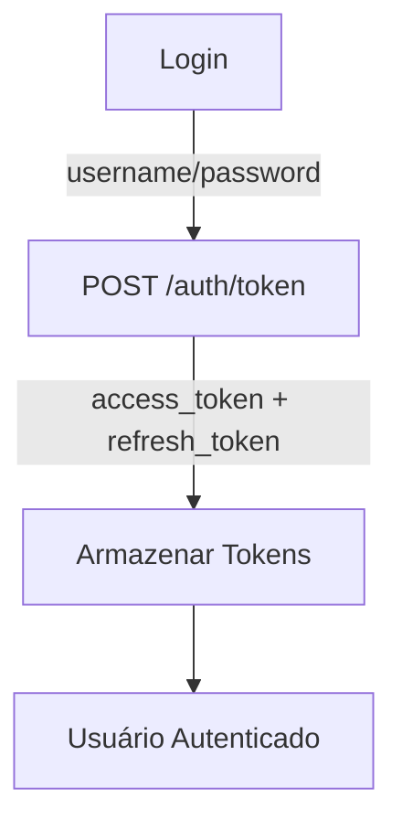
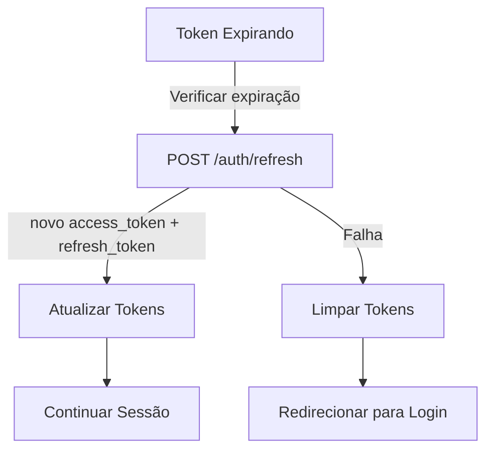
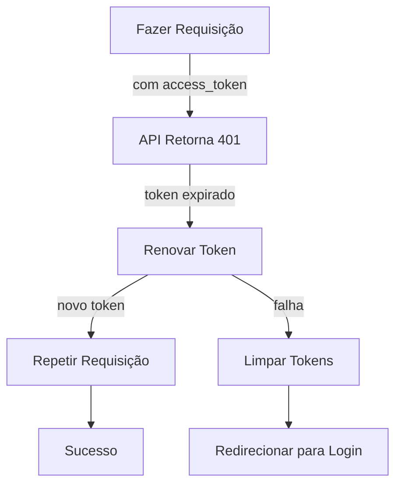

# Sistema de Gerenciamento de Tokens JWT

## 📄 Visão Geral

Este documento descreve o sistema de gerenciamento de tokens JWT implementado no Weboost Dashboard para lidar com autenticação e renovação automática de tokens.

## 🎯 Objetivos

1. **Autenticação Segura**: Usar tokens JWT para autenticação de usuários
2. **Renovação Automática**: Renovar tokens antes que expirem
3. **Experiência do Usuário**: Manter o usuário logado sem interrupções
4. **Segurança**: Lidar corretamente com tokens expirados

## 🔧 Arquitetura

### 1. Fluxo de Autenticação



### 2. Fluxo de Renovação de Token



### 3. Fluxo de Requisição com Token Expirado



## 📁 Componentes

### 1. `services/authService.ts`

**Funções Principais:**
- `loginWithApi(email, password)`: Faz login e retorna tokens
- `refreshAccessToken(refreshToken)`: Renova o token de acesso
- `getAccessToken()`: Obtém o token de acesso atual
- `getRefreshToken()`: Obtém o token de refresh atual

### 2. `services/apiInterceptor.ts`

**Funções Principais:**
- `apiRequestWithRefresh()`: Intercepta requisições e renova tokens se necessário
- `apiGetWithRefresh()`: Wrapper para GET com renovação automática
- `apiPostWithRefresh()`: Wrapper para POST com renovação automática
- `apiPutWithRefresh()`: Wrapper para PUT com renovação automática
- `apiDeleteWithRefresh()`: Wrapper para DELETE com renovação automática

### 3. `services/useTokenRefresh.ts`

**Hook Principal:**
- `useTokenRefresh()`: Verifica e renova tokens periodicamente

### 4. `App.tsx`

**Integração:**
- Executa `useTokenRefresh()` na inicialização
- Executa `useAuthCheck()` na inicialização

## 🔄 Fluxo Detalhado

### 1. Login

1. Usuário insere email e senha
2. Sistema faz POST para `/auth/token` com:
   ```
   grant_type=password
   username=<email>
   password=<senha>
   scope=
   client_id=string
   client_secret=
   ```
3. API retorna:
   ```json
   {
     "access_token": "eyJhbGciOiJIUzI1NiIsInR5cCI6IkpXVCJ9...",
     "refresh_token": "eyJhbGciOiJIUzI1NiIsInR5cCI6IkpXVCJ9...",
     "token_type": "bearer"
   }
   ```
4. Tokens são armazenados no localStorage:
   - `weboost_access_token`: Token de acesso
   - `weboost_refresh_token`: Token de refresh

### 2. Renovação Automática

1. Hook `useTokenRefresh` é executado a cada minuto
2. Decodifica o JWT para verificar a expiração
3. Se o token expirar em menos de 5 minutos:
   - Faz POST para `/auth/refresh` com:
     ```json
     {
       "refresh_token": "<current_refresh_token>"
     }
     ```
   - API retorna novos tokens:
     ```json
     {
       "access_token": "<new_access_token>",
       "refresh_token": "<new_refresh_token>",
       "token_type": "bearer"
     }
     ```
   - Novos tokens são armazenados no localStorage

### 3. Requisição com Token Expirado

1. Usuário faz uma requisição com token expirado
2. API retorna 401 Unauthorized
3. Interceptor captura o erro 401
4. Tenta renovar o token:
   - Se sucesso: repete a requisição original com o novo token
   - Se falha: limpa tokens e redireciona para login

### 4. Logout

1. Limpa ambos os tokens do localStorage
2. Redireciona para a página de login

## 🛡️ Segurança

### 1. Armazenamento de Tokens

- **Access Token**: Armazenado no localStorage
- **Refresh Token**: Armazenado no localStorage
- **Nota**: Em produção, considerar armazenamento mais seguro (ex: cookies HttpOnly)

### 2. Validade dos Tokens

- **Access Token**: Validade curta (ex: 15-30 minutos)
- **Refresh Token**: Validade mais longa (ex: 7-30 dias)
- **Renovação**: Ocorre automaticamente antes da expiração

### 3. Proteção contra Ataques

- **CSRF**: Tokens são enviados em cabeçalhos Authorization
- **XSS**: Implementar Content Security Policy (CSP)
- **HTTPS**: Todas as requisições são feitas via HTTPS

## 🔧 Configuração

### Variáveis de Ambiente

```env
# Tempo de vida dos tokens (configurado no backend)
ACCESS_TOKEN_EXPIRE_MINUTES=15
REFRESH_TOKEN_EXPIRE_DAYS=7

# Tempo para renovação automática (configurado no frontend)
TOKEN_REFRESH_THRESHOLD_MINUTES=5
```

### Parâmetros de Configuração

| Parâmetro | Valor Padrão | Descrição |
|-----------|--------------|-----------|
| `TOKEN_REFRESH_INTERVAL` | 60000ms (1 minuto) | Interval para verificar expiração |
| `TOKEN_REFRESH_THRESHOLD` | 300000ms (5 minutos) | Renovar se expirar em menos de X |

## 🛠️ Solução de Problemas

### Problema: Token Expirado

**Sintomas:**
- Requisições retornam 401 Unauthorized
- Usuário é redirecionado para login

**Solução:**
1. Verifique se o token está sendo enviado nos cabeçalhos
2. Verifique se o token está expirado (decode JWT)
3. Verifique se o refresh token está disponível
4. Verifique os logs para erros de renovação

### Problema: Renovação de Token Falha

**Sintomas:**
- Usuário é redirecionado para login inesperadamente
- Erro: "Sessão expirada. Por favor, faça login novamente."

**Solução:**
1. Verifique se o refresh token é válido
2. Verifique se o refresh token não expirou
3. Tente fazer login novamente
4. Verifique a conexão com a API

### Problema: Loop de Renovação

**Sintomas:**
- Múltiplas tentativas de renovação
- Consumo excessivo de recursos

**Solução:**
1. Verifique o intervalo de renovação
2. Verifique se a decodificação do JWT está correta
3. Adicione logs para rastrear o fluxo

## 📊 Monitoramento

### Logs Disponíveis

1. **Renovação Automática**:
   ```
   Token will expire soon, refreshing...
   Token refreshed successfully
   ```

2. **Falha na Renovação**:
   ```
   Failed to refresh token: <error>
   No refresh token available
   ```

3. **Requisição com Renovação**:
   ```
   Token expired, attempting to refresh...
   Token refreshed successfully, retrying request...
   ```

## 🎯 Melhores Práticas

### 1. Para Desenvolvedores

1. **Sempre use os wrappers com renovação**:
   ```typescript
   // Use isto:
   import { apiPostWithRefresh } from './services/apiInterceptor';
   
   // Em vez disso:
   import { apiPost } from './services/apiClient';
   ```

2. **Trate erros de autenticação**:
   ```typescript
   try {
     const response = await apiPostWithRefresh('/endpoint', data);
     const result = await handleApiResponse(response);
   } catch (error) {
     if (error.message.includes('Sessão expirada')) {
       // Redirecionar para login
     }
   }
   ```

3. **Não armazene tokens em locais inseguros**:
   - Evite armazenar em cookies sem HttpOnly
   - Evite armazenar em sessionStorage
   - Evite armazenar em variáveis globais

### 2. Para Usuários

1. **Mantenha sua sessão ativa**:
   - O sistema renova automaticamente os tokens
   - Não é necessário fazer login frequentemente

2. **Se for desconectado**:
   - Faça login novamente
   - Verifique sua conexão com a internet

3. **Segurança**:
   - Não compartilhe suas credenciais
   - Faça logout em computadores públicos

## 🚀 Integração com Novos Endpoints

Para integrar novos endpoints com o sistema de renovação de tokens:

1. **Importar o wrapper apropriado**:
   ```typescript
   import { apiGetWithRefresh, apiPostWithRefresh } from './services/apiInterceptor';
   ```

2. **Usar o wrapper nas requisições**:
   ```typescript
   // GET
   const response = await apiGetWithRefresh('/endpoint');
   
   // POST
   const response = await apiPostWithRefresh('/endpoint', data);
   
   // PUT
   const response = await apiPutWithRefresh('/endpoint', data);
   
   // DELETE
   const response = await apiDeleteWithRefresh('/endpoint');
   ```

3. **Manipular a resposta**:
   ```typescript
   const result = await handleApiResponse(response);
   ```

## 📅 Histórico de Mudanças

- **v1.0**: Implementação inicial do sistema de tokens
- **v1.1**: Adicionada renovação automática de tokens
- **v1.2**: Adicionado interceptor para requisições
- **v1.3**: Adicionado hook para renovação periódica
- **v1.4**: Melhorias no tratamento de erros

## 🤝 Contribuição

Para contribuir com melhorias:
1. Abra uma issue descrevendo o problema
2. Proponha uma solução
3. Implemente e teste a solução
4. Abra um Pull Request

## 📝 Notas Técnicas

### Decodificação de JWT

O sistema decodifica o JWT para verificar a expiração:

```typescript
const decodeJWT = (token: string): any => {
  const base64Url = token.split('.')[1];
  const base64 = base64Url.replace(/-/g, '+').replace(/_/g, '/');
  const jsonPayload = decodeURIComponent(atob(base64)...);
  return JSON.parse(jsonPayload);
}
```

### Cálculo de Expiração

```typescript
const expiresIn = payload.exp * 1000 - Date.now();
if (expiresIn < fiveMinutesInMs) {
  // Renovar token
}
```

## 🔗 Links Relacionados

- [Documentação da API](API_INTEGRATION.md)
- [Migração para Nova API](API_MIGRATION.md)
- [Criação de Clientes](CUSTOMER_CREATION.md)

## 🛡️ Considerações de Segurança

1. **Tokens**: Ambos os tokens são armazenados no localStorage
2. **Renovação**: Ocorre automaticamente antes da expiração
3. **Falha**: Se a renovação falhar, o usuário é desconectado
4. **HTTPS**: Todas as requisições são feitas via HTTPS

## 📚 Referência de Códigos de Status

| Código | Significado | Ação |
|--------|-------------|------|
| 200 | Sucesso | Continuar |
| 401 | Não autorizado | Renovar token ou login |
| 403 | Proibido | Verificar permissões |
| 500 | Erro no servidor | Tentar novamente |

## 🎓 Guia Rápido

### Para Implementar Renovação em Nova Página

1. **Importar o hook**:
   ```typescript
   import { useTokenRefresh } from './services/useTokenRefresh';
   ```

2. **Usar o hook**:
   ```typescript
   const MyPage = () => {
     useTokenRefresh(); // Renova tokens automaticamente
     // ... resto do código
   }
   ```

3. **Usar wrappers para requisições**:
   ```typescript
   const response = await apiPostWithRefresh('/endpoint', data);
   ```

## 📊 Status da Implementação

- ✅ **Autenticação com JWT**: Completo
- ✅ **Renovação de Tokens**: Completo
- ✅ **Interceptor de Requisições**: Completo
- ✅ **Hook de Renovação Automática**: Completo
- ✅ **Integração com Páginas**: Completo
- ✅ **Documentação**: Completo

## 🚀 Próximos Passos

1. **Testes Automáticos**: Adicionar testes para o sistema de tokens
2. **Monitoramento**: Adicionar métricas de uso de tokens
3. **Segurança**: Considerar armazenamento mais seguro para tokens
4. **Multi-Tab**: Lidar com sincronização de tokens entre abas

## 📝 Licença

Este sistema é parte do Weboost Dashboard e segue as mesmas políticas de licença do projeto principal.

---